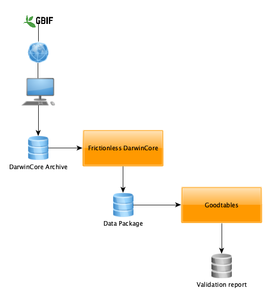
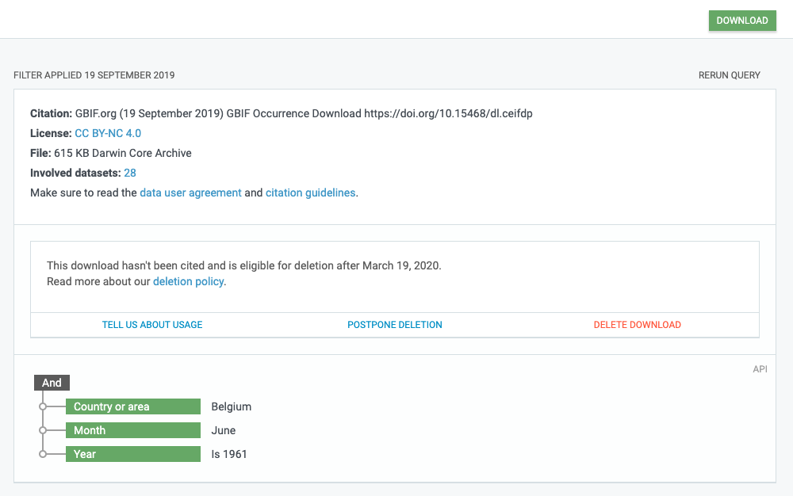

Date: 20 Sep 2019
Title: Goodtables

Today, we'll see how FrictionlessDarwinCore and Goodtables can help GBIF users with a simple data flow:


# 1. Download occurrences from GBIF portal
Login to [GBIF.org](https://www.gbif.org) Data portal.
Create and refine your query with the appropriate filters.
Download the resulting occurrences in **DarwinCore** format.
Store this DwC archive on your HD, eg under *0000637-190918142434337.zip*


# 2. Convert this DwCA into a DataPackage
```sh
$ fdwca 0000637-190918142434337.zip download_DP.zip
...

```
# 3. Validate downloaded occurrences with [goodtables](https://github.com/frictionlessdata/goodtables-py)
```sh
$ goodtables download_DP.zip
DATASET
=======
{'error-count': 8560,
 'preset': 'nested',
 'table-count': 3,
 'time': 18.842,
 'valid': False}

TABLE [1]
=========
{'datapackage': 'download_DP.zip',
 'error-count': 8533,
 'format': 'inline',
 'headers': ['gbifID',
             'abstract',
             'accessRights',
             ...
             'lastParsed',
             'lastCrawled',
             'repatriated'],
 'row-count': 4416,
 'schema': 'table-schema',
 'source': '/var/folders/19/mrkkz1tx34l98n1rs3qr3xr00000gn/T/tmpb7ugs_ug-datapackage/occurrence.txt',
 'time': 18.468,
 'valid': False}
---------
[2,64] [enumerable-constraint] The value "PRESERVED_SPECIMEN" in row 2 and column 64 does not conform to the given enumeration: "['PreservedSpecimen', 'FossilSpecimen', 'LivingSpecimen', 'MaterialSample', 'Event', 'HumanObservation', 'MachineObservation', 'Taxon', 'Occurrence']"
[25,64] [enumerable-constraint] The value "HUMAN_OBSERVATION" in row 25 and column 64 does not conform to the given enumeration: "['PreservedSpecimen', 'FossilSpecimen', 'LivingSpecimen', 'MaterialSample', 'Event', 'HumanObservation', 'MachineObservation', 'Taxon', 'Occurrence']"
[25,135] [type-or-format-error] The value "3536.0" in row 25 and column 135 is not type "integer" and format "default"
...

TABLE [2]
=========
{'datapackage': 'download_DP.zip',
 'error-count': 27,
 'format': 'inline',
 'headers': ['gbifID',
             'abstract',
             'accessRights',
            ...
             'taxonomicStatus',
             'nomenclaturalStatus',
             'taxonRemarks'],
 'row-count': 4416,
 'schema': 'table-schema',
 'source': '/var/folders/19/mrkkz1tx34l98n1rs3qr3xr00000gn/T/tmpb7ugs_ug-datapackage/verbatim.txt',
 'time': 17.675,
 'valid': False}
---------
[103,123] [maximum-length-constraint] The value "BEL" in row 103 and column 123 does not conform to the maximum length constraint of "2"
[470,36] [maximum-length-constraint] The value "Various" in row 470 and column 36 does not conform to the maximum length constraint of "2"
[470,142] [type-or-format-error] The value "707.1" in row 470 and column 142 is not type "integer" and format "default"
[1440,64] [enumerable-constraint] The value "ObservedSpecimen" in row 1440 and column 64 does not conform to the given enumeration: "['PreservedSpecimen', 'FossilSpecimen', 'LivingSpecimen', 'MaterialSample', 'Event', 'HumanObservation', 'MachineObservation', 'Taxon', 'Occurrence']"
[1441,64] [enumerable-constraint] The value "ObservedSpecimen" in row 1441 and column 64 does not conform to the given enumeration: "['PreservedSpecimen', 'FossilSpecimen', 'LivingSpecimen', 'MaterialSample', 'Event', 'HumanObservation', 'MachineObservation', 'Taxon', 'Occurrence']"
[1618,123] [maximum-length-constraint] The value "BE-WNA" in row 1618 and column 123 does not conform to the maximum length constraint of "2"
[4416,64] [enumerable-constraint] The value "Museum specimen" in row 4416 and column 64 does not conform to the given enumeration: "['PreservedSpecimen', 'FossilSpecimen', 'LivingSpecimen', 'MaterialSample', 'Event', 'HumanObservation', 'MachineObservation', 'Taxon', 'Occurrence']"
...

TABLE [3]
=========
{'datapackage': 'download_DP.zip',
 'error-count': 0,
 'format': 'inline',
 'headers': ['gbifID',
             'type',
             'format',
             'identifier',
             'references',
             'title',
             'description',
             'created',
             'creator',
             'contributor',
             'publisher',
             'audience',
             'source',
             'license',
             'rightsHolder'],
 'row-count': 176,
 'schema': 'table-schema',
 'source': '/var/folders/19/mrkkz1tx34l98n1rs3qr3xr00000gn/T/tmpb7ugs_ug-datapackage/multimedia.txt',
 'time': 0.076,
 'valid': True}
```
# 4. If necessary, add user constraints
Open data_package.json (from download_DP.zip), and add your own user constraints such as:
* individualCount (column 72) is *required*
* coordinateUncertaintyInMeters (column 135) *maximum value* is 1000
* coordinatePrecision (column 136) is *required*
See [Tabular Data Specifications](https://frictionlessdata.io/specs/table-schema) for more details on Table Schema, column type, format and constraints
```json
"resources": [
  {
    "name": "occurrence",
    "path": "occurrence.txt",
    "description": "http://rs.tdwg.org/dwc/terms/Occurrence",
    "schema": {
      "fields": [
      {
        "name": "individualCount",
        "type": "integer",
        "description": "http://rs.tdwg.org/dwc/terms/individualCount",
        "constraints": {
          "required": true
        }
      },
      {
        "name": "coordinateUncertaintyInMeters",
        "type": "number",
        "description": "http://rs.tdwg.org/dwc/terms/coordinateUncertaintyInMeters",
        "constraints": {
          "maximum": 1000.0
        }
      },
      {
        "name": "coordinatePrecision",
        "type": "number",
        "description": "http://rs.tdwg.org/dwc/terms/coordinatePrecision",
        "constraints": {
          "required": true
        }
      },
    ]
  }
}
]
```
Goodtables will now produce these constraints validation errors (Rows 4402 and 4403 only).
```sh
 $ goodtables download_DP/datapackage.json
 ...
[4402,72] [required-constraint] Column 72 is a required field, but row 4402 has no value
[4402,136] [required-constraint] Column 136 is a required field, but row 4402 has no value
[4403,135] [maximum-constraint] The value "3536.0" in row 4403 and column 135 does not conform to the maximum constraint of "1000"
[4403,136] [required-constraint] Column 136 is a required field, but row 4403 has no value
...
```
